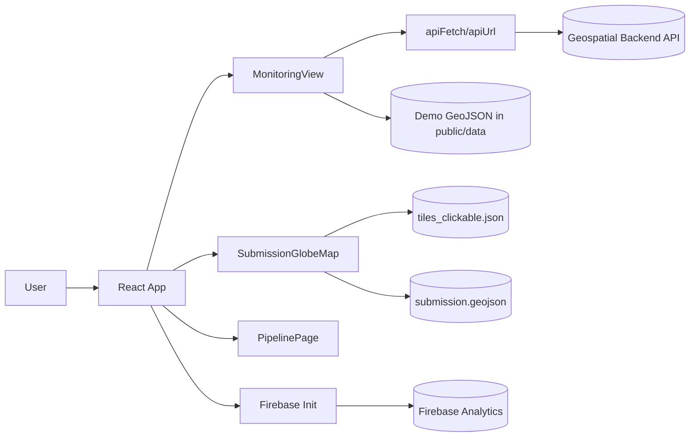

# Forest Risk Frontend (Hackathon Edition)

Interactive React frontend for visualizing deforestation risk on a globe, drilling into tile-level monitoring, and showcasing an end-to-end pipeline flow for demos.

---

## What This Frontend Does

- Renders a 3D-style interactive globe with clickable monitoring tiles.
- Lets users open a tile analysis workspace with polygon overlays and monthly imagery timelines.
- Demonstrates an "upload -> train -> map" pipeline flow suitable for hackathon storytelling.
- Connects to a geospatial backend via configurable API endpoints.
- Initializes Firebase + Analytics at app startup for production telemetry.

---

## Demo Flow (Best For Judges)

1. **Open Globe**: Show global context and available clickable tiles.
2. **Pick a Tile**: Click a green tile marker to select a region.
3. **Analyze Region**: View submitted polygons + monthly image timeline.
4. **Show Pipeline Story**: Open pipeline page and run the analyze simulation.
5. **Return to Globe**: Explain the complete loop from ingestion to map output.

---

## System Architecture



### Frontend Module Architecture

- `App.tsx`: Screen router/state orchestrator (`globe`, `analyze`, `pipeline`).
- `components/SubmissionGlobeMap.tsx`: Globe map + tile picking experience.
- `components/MonitoringView.tsx`: Tile analysis page (submission polygons + imagery strip).
- `components/SubmissionMap.tsx`: Satellite map with polygon filtering by `time_step`.
- `components/MonitoringSentinelStrip.tsx`: Monthly preview strip for selected tile.
- `components/PipelinePage.tsx`: Demo pipeline UX and progress timeline.
- `lib/apiFetch.ts` + `lib/apiUrl.ts`: Backend URL resolution and ngrok header handling.
- `lib/firebase.ts`: Firebase app/bootstrap + analytics initialization.

---

## Tech Stack

- **Framework**: React 19 + TypeScript
- **Build Tool**: Vite 8
- **Mapping**: MapLibre GL
- **Charts**: Recharts
- **3D/Visual Layer Support**: Three.js + React Three Fiber ecosystem
- **Hosting/Deploy**: Firebase Hosting

---

## Project Structure

```text
frontend/
  src/
    components/            # UI + map/monitoring/pipeline components
    lib/                   # API, firebase, geo helpers
    types/                 # shared TS types
    App.tsx                # top-level screen flow
    main.tsx               # app bootstrap + firebase init
  public/
    data/                  # demo/submission geojson assets
    textures/              # globe texture assets
  .env.example             # environment variable template
  vite.config.ts           # dev proxy configuration
```

---

## Quick Start

### Prerequisites

- Node.js 20+ (recommended)
- npm 10+
- Backend API running locally (default expected at `http://127.0.0.1:8001`)

### Install and Run

```bash
npm install
cp .env.example .env.local
npm run dev
```

App starts on Vite's default URL (typically `http://localhost:5173`).

---

## Environment Variables

Create `frontend/.env.local`:

| Variable | Required | Purpose |
| --- | --- | --- |
| `VITE_API_BASE_URL` | Optional | Full backend origin for non-proxied/prod use. Leave empty in local dev to use Vite proxy. |
| `VITE_FIREBASE_API_KEY` | Yes | Firebase project API key. |
| `VITE_FIREBASE_AUTH_DOMAIN` | Yes | Firebase auth domain. |
| `VITE_FIREBASE_PROJECT_ID` | Yes | Firebase project id. |
| `VITE_FIREBASE_STORAGE_BUCKET` | Optional | Firebase storage bucket. |
| `VITE_FIREBASE_MESSAGING_SENDER_ID` | Optional | Firebase messaging sender id. |
| `VITE_FIREBASE_APP_ID` | Yes | Firebase app id. |
| `VITE_FIREBASE_MEASUREMENT_ID` | Optional | Firebase analytics measurement id. |

> Note: Firebase config is validated at startup. Missing core values will throw an initialization error.

---

## Backend API Expectations

This frontend expects these endpoints (proxied in local dev via `vite.config.ts`):

- `GET /submission-geojson?max_features=150`
- `GET /tile-sentinel-frames?lat=<>&lng=<>&max_frames=<>`
- `GET /tile-sentinel-preview/...`
- `GET /tile-sentinel1-frames?lat=<>&lng=<>&max_frames=<>` (prepared, optional flow)
- `GET /tile-sentinel1-preview/...` (prepared, optional flow)
- `POST /analyze` (reserved/proxied)
- `POST /vegetation-timeseries` (reserved/proxied)

Fallback behavior:
- If submission endpoint fails, app uses bundled `public/data/demo_predictions.geojson`.
- Static demo data (`public/data/submission.geojson`) is still used in globe/overlay contexts.

---

## Available Scripts

- `npm run dev` - Start local development server
- `npm run build` - Type-check + production build
- `npm run preview` - Preview production build locally
- `npm run lint` - Run ESLint
- `npm run deploy` - Build and deploy to Firebase Hosting

---

## Deployment

Firebase deployment script is already configured:

```bash
npm run deploy
```

Before deployment:
- Ensure all `VITE_FIREBASE_*` variables are set correctly.
- Set `VITE_API_BASE_URL` to your production backend origin if backend is hosted separately.

---

## Troubleshooting

- **Globe does not render**
  - Verify browser supports WebGL.
  - Disable extensions that block graphics contexts.
  - Check console for MapLibre initialization errors.

- **API calls failing in local development**
  - Confirm backend runs on `127.0.0.1:8001`.
  - Ensure endpoint paths match `vite.config.ts` proxy entries.
  - If using ngrok backend, `apiFetch` automatically adds the bypass header.

- **Blank app / startup crash**
  - Validate `frontend/.env.local` values.
  - Missing required Firebase fields causes app init to fail.

---

## Hackathon Pitch Notes

- Problem: Detecting and monitoring deforestation at scale is hard and slow.
- Solution: Interactive geospatial UI combining tile selection, polygon overlays, and temporal imagery.
- Differentiator: Fast "globe -> inspect -> pipeline" narrative in one user experience.
- Demo-ready: Works with live API when available, and includes safe fallbacks for stable presentations.

---

## Next Improvements (Post-Hackathon)

- Enable real file upload pipeline (currently staged/demo behavior in pipeline UI).
- Connect pipeline completion to live globe marker insertion.
- Re-enable vegetation and Sentinel-1 views currently scaffolded in code.
- Add Cypress/Playwright e2e demo path tests.

---

Built by team **error404.ai** for the osapiens makeathon challenge.
